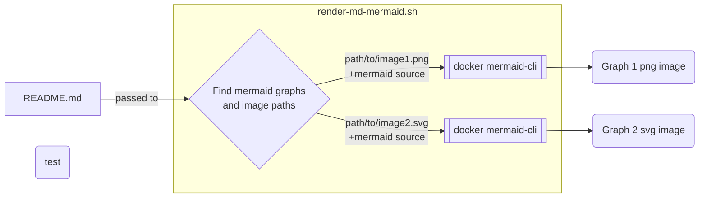

```mermaid
graph LR
    A[README.md]
    B{Find mermaid graphs<br>and image paths}
    C[[docker mermaid-cli]]
    D[[docker mermaid-cli]]
    E(Graph 1 png image)
    F(Graph 2 svg image)
    G(test)

    A -->|passed to| B
    subgraph render-md-mermaid.sh
      B --> |path/to/image1.png<br>+mermaid source| C
      B --> |path/to/image2.svg<br>+mermaid source| D
    end
    C --> E
    D --> F
```
